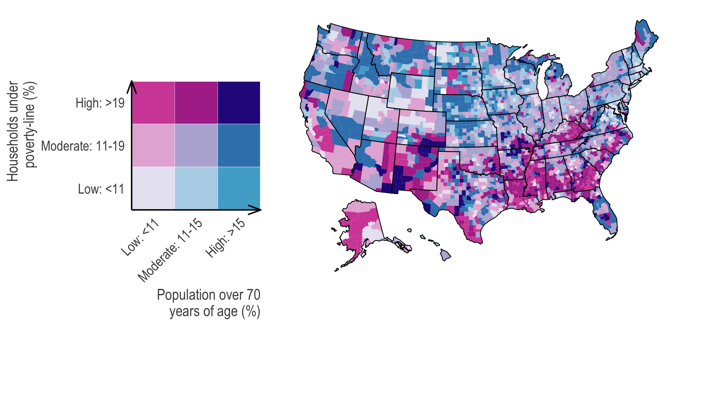

<!-- README.md is generated from README.Rmd. Please edit that file -->

```{r setup, include = FALSE}
knitr::opts_chunk$set(
  collapse = TRUE,
  comment = "#>"
)
```
## US-county level variation in intersecting individual, household, and community characteristics relevant to COVID-19 and planning an equitable response: A cross-sectional analysis

<p align = "center">
```{r echo=FALSE, out.width = "650px", fig.align='center'}

```
</p>

## Introduction 

This is reproducible code for our pre-print, [*US-county level variation in intersecting individual, household, and community characteristics relevant to COVID-19 and planning an equitable response: A cross-sectional analysis*](http://dx.doi. org/10.1136/bmjopen-2020- 039886), which uses public-access county-level data to highlight characteristics of COVID-19 risk factors across different levels. We use bivariate maps to show both the intersection and spatial patterning of these risk factors. The full citation is:

> Chin T, Kahn R, Li R, Chen JT, Krieger N, Buckee CO, Balsari S, and Kiang MV. US-county level variation in intersecting individual, household and community characteristics relevant to COVID-19 and planning an equitable response: a cross- sectional analysis. BMJ Open 2020;0:e039886. doi:10.1136/ bmjopen-2020-039886

An interactive companion app for our paper is available at [https://ccdd-hsph-harvard.shinyapps.io/county-risk/](https://ccdd-hsph-harvard.shinyapps.io/county-risk/). 

### Abstract
**Objectives** To illustrate the intersections of, and intercounty variation in, individual, household and community factors that influence the impact of COVID-19 on US counties and their ability to respond.

**Design** We identified key individual, household and community characteristics influencing COVID-19 risks of infection and survival, guided by international experiences and consideration of epidemiological parameters of importance. Using publicly available data, we developed an open-access online tool that allows county-specific querying and mapping of risk factors. As an illustrative example, we assess the pairwise intersections of age (individual level), poverty (household level) and prevalence of group homes (community-level) in US counties. We also examine how these factors intersect with the proportion of the population that is people of colour (ie, not non-Hispanic white), a metric that reflects histories of US race relations. We defined ‘high’ risk counties as those above the 75th percentile. This threshold can be changed using the online tool.

**Setting** US counties.

**Participants** Analyses are based on publicly available county-level data from the Area Health Resources Files, American Community Survey, Centers for Disease Control and Prevention Atlas file, National Center for Health Statistic and RWJF Community Health Rankings.

**Results** Our findings demonstrate significant intercounty variation in the distribution of individual, household and community characteristics that affect risks of infection, severe disease or mortality from COVID-19. About 9% of counties, affecting 10 million residents, are in higher risk categories for both age and group quarters. About 14% of counties, affecting 31 million residents, have both high levels of poverty and a high proportion of people of colour.

**Conclusion** Federal and state governments will benefit from recognising high intrastate, intercounty variation in population risks and response capacity. Equitable responses to the pandemic require strategies to protect those in counties at highest risk of adverse COVID-19 outcomes and their social and economic impacts.

### Issues

Please report issues via email or the [issues page](https://github.com/mkiang/county_preparedness/issues). 

## Data

All data used are publicly-available. Our cleaned, harmonized, analytic data can be found in the `./data/` folder along with the corresponding `data_dictionary.csv`.

## Project structure

- `./code/` contains all code needed to reproduce our analyses. This code is designed to be run in order. Each file is a discrete step in the analytic pipeline and contains a brief description of the file objective at the top. I describe the overarching objective of some of the files below. 
- `./data/` contains all processed data that results from our `./code/` pipeline.
- `./data_raw/` contains publicly-available data that will be used in the analytic pipeline. 
- `./plots/` contains the manuscript-ready plots in both `pdf` and `jpg` formats. 

## Authors

- Taylor Chin (: [\@taylorchin](https://twitter.com/taylorchin))
- Rebecca Kahn (: [rek160](https://github.com/rek160) | : [\@rebeccajk13](https://twitter.com/rebeccajk13))
- [Ruoran Li](https://scholar.harvard.edu/rli/home) (: [ruoranepi](https://github.com/ruoranepi) | : [\@ruoranepi](https://twitter.com/ruoranepi))
- [Jarvis Chen](https://www.dfhcc.harvard.edu/insider/member-detail/member/jarvis-t-chen-scd/) 
- [Nancy Krieger](https://www.hsph.harvard.edu/nancy-krieger/) 
- [Caroline Buckee](https://www.hsph.harvard.edu/magazine/magazine_article/the-uses-of-outrage/) (: [\@Caroline_OF_B](https://twitter.com/Caroline_OF_B))
- [Satchit Balsari](https://fxb.harvard.edu/people/satchit-balsari/) (: [\@Satchit_Balsari](https://twitter.com/Satchit_Balsari))
- [Mathew Kiang](https://mathewkiang.com) (: [mkiang](https://github.com/mkiang) | : [\@mathewkiang](https://twitter.com/mathewkiang))

## Notes

- An earlier pre-print version of this paper is available on medRxiv: [*U.S. county-level characteristics to inform equitable COVID-19 response*](https://www.medrxiv.org/content/10.1101/2020.04.08.20058248v1). 
- Session information is saved in `./session_info.txt`. 
